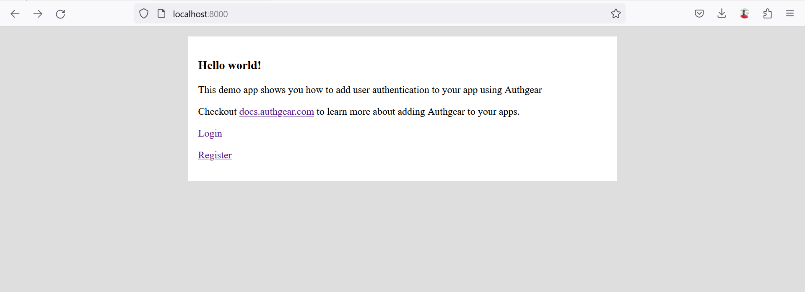
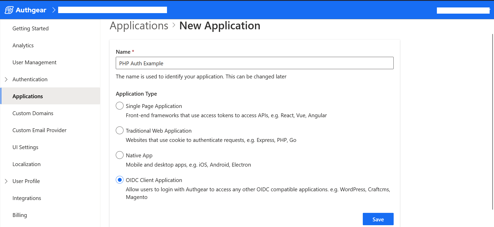
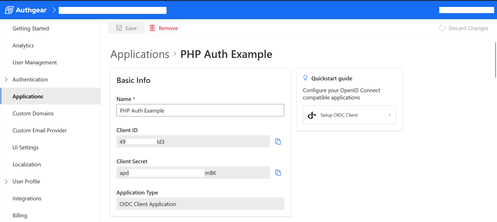
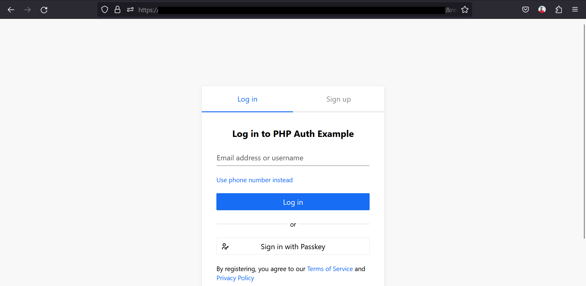
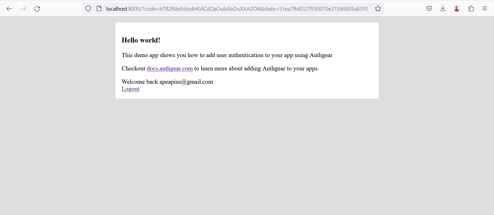

# PHP

With Authgear you can implement user authentication in a vanilla PHP application using OAuth.

In this guide, we'll cover how to implement OAuth in a regular PHP web application with Authgear as the Identity Provider.

### What You Will Learn

At the end of this post, you'll be able to do the following:

* How to create an Authgear Application
* How to enable email and password sign-in
* How to sign in with Authgear from a PHP app
* How to request user info from Authgear

### Pre-requisites

To follow along, you'll need the following:

* PHP runtime (E.g XAMPP for testing offline on Windows devices)
* An Authgear account. [Sign up](https://accounts.portal.authgear.com/signup) for free if you don't have an account yet.
* [Composer](https://getcomposer.org/download/) (PHP package manager) installation

#### What We Will Build

In this guide, we'll be building a basic PHP application that lets a user sign in with their registered email and password.

The application will welcome the user with their email address after they sign in successfully. If the user is not signed in, the application will display links to Register or Login.

The following screenshot shows what the User Interface for the app will look like:

<figure><figcaption></figcaption></figure>

### How to Add User Authentication to PHP with Authgear

Now let's dive into the actual steps of how to add Authgear to a PHP application.

#### Step 1: Set up Authgear Application

The first step you need to take is to create a new application or configure an existing application on the Authgear [Portal](https://portal.authgear.com).

To do that, log in to Authgear Portal, and select your project (or create a new one if you don't have any yet). From your project dashboard navigate to the **Applications** section and enter the details for your new application as shown below:

<figure><figcaption></figcaption></figure>

Once you're done, click on the Save button to continue. Then, click on Next to see the configuration page for your application.

<figure><figcaption></figcaption></figure>

The application configuration page contains basic information like `Client ID` an `Client Secret` that we'll use later in this tutorial. Hence, try to note the values down.

In addition to basic information, you can find other configuration information including endpoints and Authorized Redirect URIs.

#### Step 2: Authorized Redirect URIs

The Authorized Redirect URIs section contains a link to the page you want Authgear to redirect users to after login.

Update the value for Authorized Redirect URIs to a page on your application. For our example PHP application the value will be `http://localhost` because we plan to test run it offline using XAMPP. Also, try to note this value down as we'll be using it in later steps.

#### Step 3: Create a PHP Project

Create a new PHP project on your computer and add an `index.php` file to the root of the project folder.

Add the following code to index.php to create the User Interface of the example app.

```php
<?php
$appUrl = "REPLACE WITH YOUR AUTHGEAR PROJECT URL";
?>
<!DOCTYPE html>
<html lang="en">
<head>
    <meta charset="UTF-8">
    <meta name="viewport" content="width=device-width, initial-scale=1.0">
    <title>PHP Demo - Home</title>
</head>
<body style="background-color: #DEDEDE">
    <div style="max-width: 650px; margin: 16px auto; background-color: #FFFFFF; padding: 16px;">
        <h3>Hello world!</h3>
        <p>This demo app shows you how to add user authentication to your app using Authgear</p>
        <p>Checkout <a href="https://docs.authgear.com">docs.authgear.com</a> to learn more about adding Authgear to your apps.</p>
        
        <p><a href="login.php">Login</a></p>
        <p><a href="<?php echo $appUrl ?>/signup">Register</a></p>
    </div>
</body>
</html>
```

**Note**: The Login link in the above code currently points to login.php, we'll create this file later.

#### Step 4: Add Authgear Configuration to PHP Project

In this step, we'll add our Authgear application configuration to the PHP project.

We'll use the [OAuth 2.0 Client](https://github.com/thephpleague/oauth2-client) PHP package for the configuration.

Install the package manually from Github or via Composer by running the following command from your PHP project's root directory:

```sh
composer require league/oauth2-client
```

Next, after the package is installed, create a new `config.php` file in the PHP project folder. Add the following code to the file:

```php
<?php
require 'vendor/autoload.php';

$appUrl = "PLACE_YOUR_PROJECT_URL_HERE";
$clientID = "PLACE_YOUR_CLIENT_ID_HERE";
$clientID = "PLACE_YOUR_CLIENT_SECRET_HERE";
$redirectUri = "PLACE_YOUR_REDIRECT_URI_HERE";

$provider = new \League\OAuth2\Client\Provider\GenericProvider([
    'clientId'                => $clientID,    // The client ID assigned to you by the provider (authgear).
    'clientSecret'            => $clientSecret,    // The client secret is assigned to you by the provider.
    'redirectUri'             => $redirectUri, // The authorized Redirect URI you specified in your authgear app.
    'urlAuthorize'            => $appUrl.'/oauth2/authorize',
    'urlAccessToken'          => $appUrl.'/oauth2/token',
    'urlResourceOwnerDetails' => $appUrl.'/oauth2/userInfo',
    'scopes' => 'openid'
]);
?>
```

**Note**: Replace the values for `clientId`, `clientSecret`, `redirectUri` with corresponding values from the Authgear application you created in Step 1.

#### Step 5: Add Login Authorization

The flow for Login on our app is as follows:

1. The user clicks on the Login button
2. User is redirected to the Authgear authorization page where they can sign in using email and password or any other sign-in methods you have enabled for your Authgear project.
3. The user is redirected back to your website with an authorization code.

In order to implement the above, we need to create a `login.php` file in our project's root directory. Add the following code to the login.php file:

```php
<?php
include "config.php";

if (!isset($_GET['code'])) {
    // Fetch the authorization URL from the provider; this returns the
    // urlAuthorize option and generates and applies any necessary parameters
    // (e.g. state).
    $authorizationUrl = $provider->getAuthorizationUrl();

    // Get the state generated for you and store it to the session.
    $_SESSION['oauth2state'] = $provider->getState();

    // Redirect the user to the authorization URL.
    header('Location: ' . $authorizationUrl);
    exit;
}
?>
```

At this point, if you try running the example app in a browser and click the Login link in index.php, your app should redirect to the Authgear login page. If you sign in successfully, you should be redirected back to the redirect URL you specified earlier in your project configuration.

<figure><figcaption></figcaption></figure>

Authgear will redirect to your Authorized Redirect URI with extra parameters like `code` or error message in the URL. The value for the code parameter is your authorization code. In the next step, we'll use the authorization code to generate an access token.

#### Step 6: Get User Info

Usually, after successful sign in you'll want to start using the current user's info to offer custom experience in your app.

In this step, we'll use the PHP OAuth 2.0 Client once more to interact with our Authgear app.

First, open config.php and search for the line with the following code:

```php
$appUrl = "REPLACE WITH YOUR AUTHGEAR PROJECT URL";
```

Replace the above line with this code:

```php
include "config.php";

// if code is set, get access token
if (isset($_GET['code'])) {
    $code = $_GET['code'];

    try {
        $accessToken = $provider->getAccessToken('authorization_code', [
            'code' => $code
        ]);
        $_SESSION['accessToken'] = $accessToken;
        

    } catch (\League\OAuth2\Client\Provider\Exception\IdentityProviderException $e) {

        // Failed to get the access token or user details.
        exit($e->getMessage());

    }
} 
```

The above code exchanges the authorization code returned in the redirect for an access token. It then stores the access token in the PHP session so that we can use this token in future requests to protected resources.

Now that we have the access token, let's try to get the current user's details. To do that, update the HTML part in index.php like this:

```php
<div style="max-width: 650px; margin: 16px auto; background-color: #FFFFFF; padding: 16px;">
        <h3>Hello world!</h3>
        <p>This demo app shows you how to add user authentication to your app using Authgear</p>
        <p>Checkout <a href="https://docs.authgear.com">docs.authgear.com</a> to learn more about adding Authgear to your apps.</p>
        <?php
        if (isset($_SESSION['accessToken'])) {

            //if access token exists in session, attempt to fetch user info
            $resourceOwner = $provider->getResourceOwner($accessToken);
            $userInfo = $resourceOwner->toArray();

            echo "Welcome back " . $userInfo['email'];
            echo "<br/>";
            echo '<a href="">Logout</a>';
            
        } else { ?>
        <p><a href="login.php">Login</a></p>
        
        <?php
        } 
        ?>
    </div>
```

Now test the app on your browser again and you should get the following page after login:

<figure><figcaption></figcaption></figure>

We've successfully added user authentication to our PHP app using Authgear as the identity provider. The above page displays a welcome message with the email address the user registered with on your Authgear project. You can display other info about the user from the value of `$userInfo` variable.

### Summary

In this post, we covered how to get started with adding Authgear to a regular web app built with PHP and no framework.

We also tried out an example of using the Authgear authorization code to retrieve an access token, then we used the token to access the user info endpoint.

Here's a link complete source code for [our example app on Github](https://github.com/authgear/authgear-example-php).

There's so much more you can do with Authgear and you can continue learning by checking out more topics on the [documentation page](https://docs.authgear.com/get-started).
