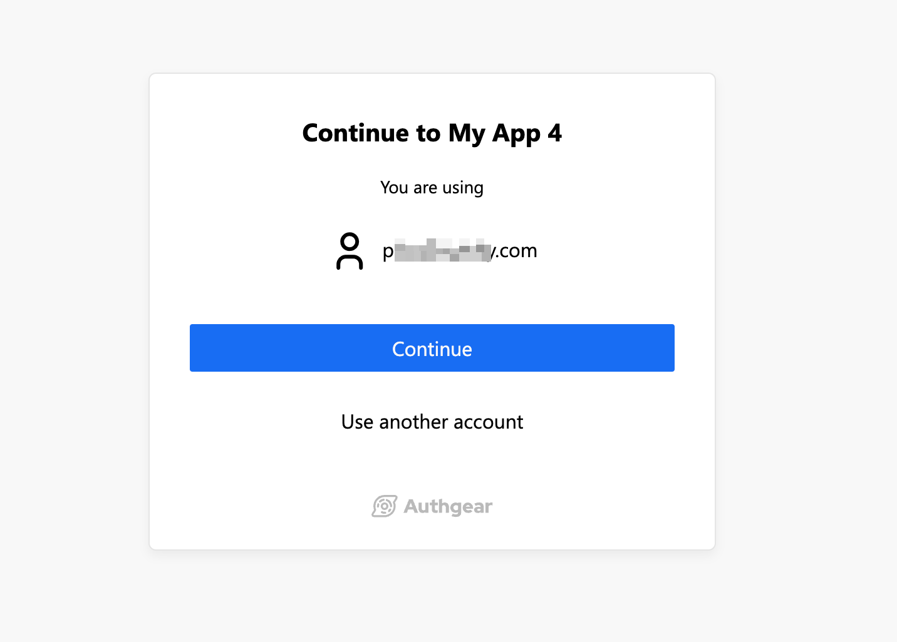

# Force Authgear to Show Login Page

The normal authentication flow for Authgear starts with your application making a request to the Authgear authorization endpoint.  This request will usually load the login or signup page. However, AuthUI may show the "Continue Screen" or `select_account` flow instead if there is an existing session stored on the user's browser.

<figure><figcaption></figcaption></figure>

In this guide, you'll learn how to force Authgear to always show the login page even when there is an existing session on the user's browser.

### How to Force Authgear to Show Login Page

The `prompt="login"` parameter which is defined in the [OIDC spec](https://openid.net/specs/openid-connect-core-1\_0.html#AuthRequest) can force AuthUI to show the login page. Authgear SDKs have a `prompt` parameter that can be used to set prompt="login". Once the `prompt` parameter is set to `login` Authgear will always show the login screen when your application calls the SDK's authenticate method.

The following code shows how to set `prompt: "login"` in Authgear SDKs:



```javascript
authgear
  .startAuthentication({
    redirectURI: "<AUTHGEAR_REDIRECT_URI>",
    prompt: PromptOption.Login,
  })
```



```typescript
authgear
  .authenticate({
    redirectURI: 'com.reactnativeauth://host/path',
    prompt: PromptOption.Login,
  })
```



```java
AuthenticateOptions options = new AuthenticateOptions("<AUTHGEAR_REDIRECT_URI>");
List<PromptOption> promptOptions = Arrays.asList(PromptOption.LOGIN);
options.setPrompt(promptOptions);
mAuthgear.authenticate(options, new OnAuthenticateListener() {
    @Override
    public void onAuthenticated(@Nullable UserInfo userInfo) {
        
    }

    @Override
    public void onAuthenticationFailed(@NonNull Throwable throwable) {
        Log.d(TAG, throwable.toString());
    }
});
```



```swift
authgear?.authenticate(
    redirectURI: "<AUTHGEAR_REDIRECT_URI>",
    prompt: "login"
)
```



```dart
_authgear.authenticate(
        redirectURI: "<AUTHGEAR_REDIRECT_URI>",
        prompt: "login",
      );
```



