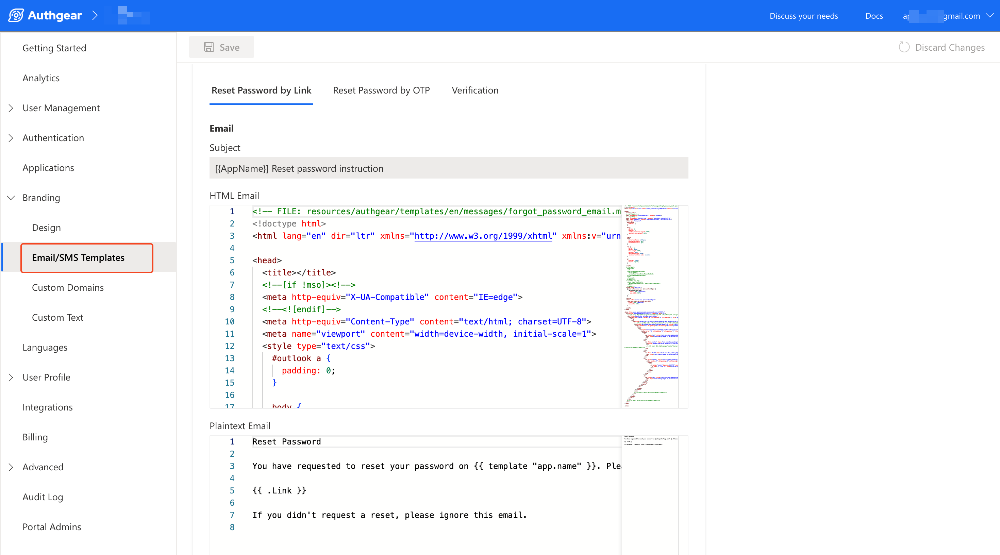

# Custom Email and SMS Templates

Authgear allows you to modify the default Email/SMS template content for sending password reset and verification messages.

To set a custom email or SMS template, log in to Authgear Portal then navigate to **Branding** > **Email/SMS Templates**.

<figure><figcaption></figcaption></figure>

You can edit the Email/SMS Templates for each language you have enabled for your application.

**Note:** You must upgrade your [project plan](https://docs.authgear.com/reference/billing-faq) to a paid plan to edit the templates.
