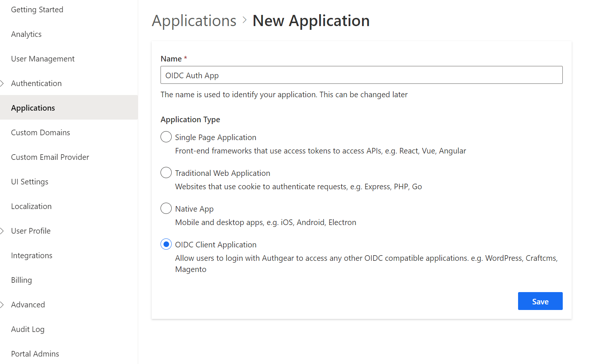

# Access User Profiles

To access any of the applications in your Authgear account, each user must have a profile in the account. [User Profiles](../../integrate/user-profile.md) contain information about your users such as name, contact information, and [standard](../../integrate/user-profile.md#standard-attributes) and[ custom attributes](../../integrate/user-profile.md#custom-attributes) you define. You can retrieve and manage user profiles in the following ways:

* [From the Authgear UI portal](access-user-profiles.md#access-user-profiles-from-the-authgear-ui-portal).
* [From your apps using Authgear SDKs](access-user-profiles.md#access-user-profiles-from-apps-using-authgear-sdks).
* [From Admin API](access-user-profiles.md#access-user-profiles-from-admin-api).
* [From the OIDC UserInfo endpoint](access-user-profiles.md#access-user-profiles-from-the-oidc-userinfo-endpoint).


The standard attributes in UserProfile in OIDC are a standardized schema for representing the end-users identity information and you can not add or delete them. To introduce additional attributes, use custom attributes.&#x20;


### Prerequisites

* **An Authgear account:** You need an Authgear account to follow this guide. If you don't have one, you can [create it for free](https://accounts.portal.authgearapps.com/signup?\_ga=2.103619076.563520449.1688969336-1174359617.1686657394) on the Authgear website.
* **A Registered App:** You need a [registered application](https://docs.authgear.com/get-started/website#setup-application-in-authgear) (client) in Authgear.

### Access user profiles from the Authgear UI portal

It is the fastest and easiest way to view user profiles and manage them.&#x20;

<details>

<summary>Expand this to see the guide</summary>

To view see user profile of a specific user:

1. Go to the [Authgear Portal](https://portal.authgearapps.com/).
2. Navigate to **User Management.**
3. Choose a user you would like to view a profile.
4. On the **User Details** page, you will see the **Profile** tab.


To manage access for standard attributes for all users:

Go to **Portal** > **User Profile** > **Standard Attributes**


To manage access and add new custom attributes for all users:

Go to **Portal** > **User Profile** > **Custom Attributes** and click **Add New Attribute**


</details>

### Access user profiles from apps using Authgear SDKs

Once Authgear completes authentication and returns control to your application, it provides the user profile to the application. Most developers prefer to use the **Authgear SDKs** to get the UserInfo object using the **fetch user info** function. To start using this function read [getting started guides](../../get-started/start-building/) relevant to the **SDK of your choice**. Here are some code snippets for different SDKs:



```javascript
try{
    const userInfo = await authgear.fetchUserInfo()
} catch(e) {
    // failed to fetch user info
}
```



```swift
authgear.fetchUserInfo { userInfoResult in
    // sessionState is now up to date
    // it will change to .noSession if the session is invalid
    let sessionState = authgear.sessionState

    switch userInfoResult {
    case let .success(userInfo):
        // read the userInfo if needed
    case let .failure(error):
        // failed to fetch user info
        // the refresh token maybe expired or revoked
}
```



```kotlin
authgear.fetchUserInfo(new OnFetchUserInfoListener() {
    @Override
    public void onFetchedUserInfo(@NonNull UserInfo userInfo) {
        // sessionState is now up to date
        // read the userInfo if needed
    }

    @Override
    public void onFetchingUserInfoFailed(@NonNull Throwable throwable) {
        // sessionState is now up to date
        // it will change to NO_SESSION if the session is invalid
    }
});
```



```dart
try {
  UserInfo userInfo = await authgear.getUserInfo();
  // read the userInfo if needed
} catch (e) {
  // failed to fetch user info
  // the refresh token maybe expired or revoked
}
// sessionState is now up to date
SessionState state = authgear.sessionState;
```



```csharp
try
{
    var userInfo = await authgear.FetchUserInfoAsync()
}
catch
{
    // failed to fetch user info
    // the refresh token maybe expired or revoked
}
```



### Access user profiles from Admin API

Authgear provides an [Admin API](../../apis/admin-api/) GraphQL endpoint that allows applications and services to access and manipulate the User Profile object. The [API Explorer](../../apis/admin-api/#api-explorer) lets users interactively explore the Admin API. With the API Explorer, you can search for users' profiles or update their standard or custom attributes. See the example steps of how to achieve this below:

<details>

<summary>Expand this to see the guide</summary>

1. Go to the **Portal**.
2. Navigate to the **Advanced** -> **Admin API.**
3. Find a section called **GraphiQL Explorer.**
4. Click on the **GraphiQL tool** link.


The explorer will be opened in a separate browser tab.


5. Search for a user by `email`and put in your query `standardAttributes` and `customAttributes`. For example:

```json5
query {
  users(
    searchKeyword: "bobur@oursky.com"
  ) {
    edges {e
      node {
	standardAttributes
        customAttributes
      }
    }
  }
}
```

</details>

### Access user profiles from the OIDC UserInfo endpoint

The OpenID Connect (OIDC) [UseInfo](../../integrate/user-profile.md#userinfo-endpoint) endpoint is a protected resource that provides information about a user when a service provider presents an access token that has been issued by your **Authgear Token endpoint**. The scopes in the access token specify the user attributes that are returned in the response of the user info endpoint. It is important to note that the `openid` scope must be one of the access token claims.

To access a user's profile using the UserInfo endpoint of OpenID Connect, you need to follow these steps:

<details>

<summary>Expand this to see the guide</summary>

To access a user profile endpoint, you need to have a JWT access token in the header of a request to `/oauth2/userinfo`

We are going to use **cURL** commands in our API calls or you can also use [Postman](https://www.postman.com/) or similar tools.

**Prerequisites**

* Make sure that you have a registered app type of **OIDC Client Application** in Authgear Portal.

**Step 1: Obtain the necessary parameters**

Open your **OpenID Auth App** configuration, and find **Client ID**, **Client Secret**, and check **Authorization**, and **Token** endpoints. You will use them in the next steps.


**Step 2: Construct the authorization endpoint URL**

The URL for this endpoint is usually provided by the authorization server and includes parameters specifying the requested `scope`, `client_id`, and response\_type. Here's an example URL for the authorization endpoint:

```bash
https://<YOUR_AUTHGEAR_ENDPOINT>/oauth2/authorize?client_id={YOUR_CLIENT_ID}&response_type=code&scope=openid
```

Replace `<YOUR_AUTHGEAR_ENDPOINT>` with your Authgear server's domain, `YOUR_CLIENT_ID` with your application's Client ID from **OpenID App.**

**Step 3: Redirect the user to the authorization endpoint**

Next, you need to redirect the user to the authorization endpoint. You can just put the URL in your browser and log in with a user credential you are interested to retrieve an access token for. After successful authentication and consent, the Authgear will redirect the user back to your specified redirect URI, including an **authorization code** as a query parameter. You will need the code in the next step&#x20;

.png>)

**Step 4: Obtain an access token**

You need to make a request to the **OpenID App's Token endpoint** to exchange the **authorization code** we retrieved in the previous step for an access token.&#x20;

* The token endpoint URL is usually something like `https://<YOUR_AUTHGEAR_ENDPOINT>/oauth2/token`.
* Include parameters such as `grant_type=authorization_code`, `code=AUTHORIZATION_CODE`, `client_id=YOUR_CLIENT_ID`, `client_secret=YOUR_CLIENT_SECRET`, and `redirect_uri=YOUR_REDIRECT_URI`.
* Make a POST request to the token endpoint to obtain the access token.

```bash
curl --request POST \
  --url 'https://<YOUR_AUTHGEAR_ENDPOINT>/oauth2/token' \
  --header 'content-type: application/x-www-form-urlencoded' \
  --data grant_type=authorization_code \
  --data code={YOUR_AUTHORIZATION_CODE} \
  --data redirect_uri={YOUR_REDIRECT_URI} \
  --data 'client_id={YOUR_CLIENT_ID}' \
  --data client_secret={YOUR_CLIENT_SECRET} \
  --data scope=openid
```

**Step 5: Make a request to the Userinfo endpoint**

Once you have obtained a **JWT access token**, you can use it to make a request to the Userinfo endpoint. The request to the Userinfo endpoint should include the access token in the `Authorization` header using the `Bearer` scheme.

```bash
curl -X GET \
  -H "Authorization: Bearer ACCESS_TOKEN" \
  https://<YOUR_AUTHGEAR_ENDPOINT>/userinfo

```

If you are using Postman, you can enable the Authorization type of OAuth2.0, provide the necessary information for getting the authorization code, obtaining an access token and use that token to request the Userinfo endpoint:



</details>


