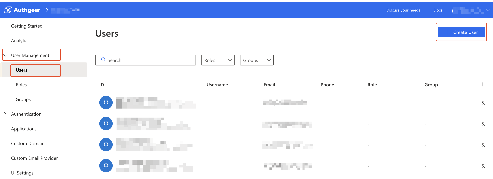
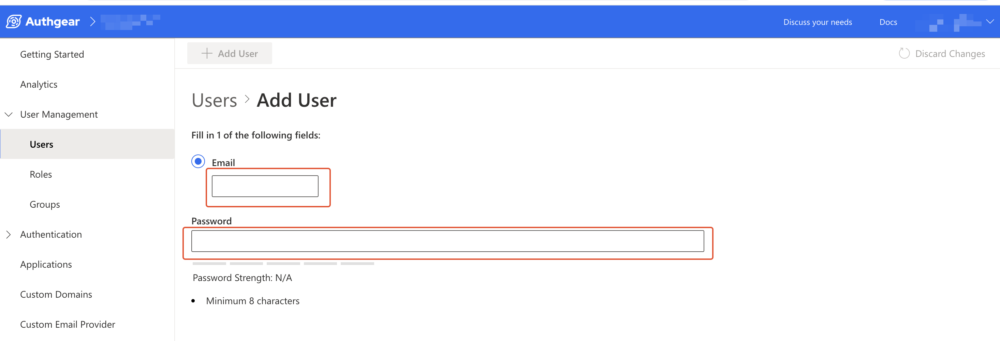
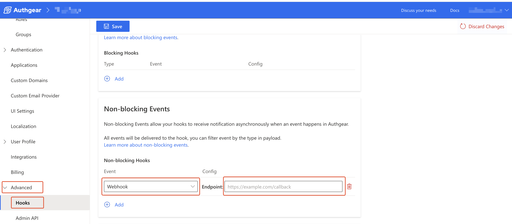

# How to Handle Password While Creating Accounts for Users

In some use cases, you (the admin) may need to create an account on behalf of a user. In such cases, the admin can do this either from the Portal or using the Admin API. A common question that arises when admins create accounts for users is how to handle the process of setting a password for the user.

In this post, we'll cover a few options and describe an example of automating the process using webhooks.

Some of the options are:

* Generate a random hard-to-guess and unique password for each user and throw it away. Then, send an email or SMS to the user asking them to set a new password using the Forgot Password feature.
* Or, generate a unique and secure password and then send it in an email to the user so they can continue to log in with it. Here, it is up to the user to reset the initial password after they log in.

## How to Create Accounts for Users and Email them Instructions on How to Reset Password

Continue reading to see a detailed example of how to create a new account for a user and email them instructions on how to set a new password.

### Step 1: Create a New User Account via Authgear Portal or Admin API

You can create a new account on behalf of a user from either the Authgear Portal or using the Admin API. Using any of the above options will trigger the `user.created` event.

**Note:** Creating a user via the batch [user import API](import-users-using-user-import-api.md) does not trigger `user.created`. Also, you need to set up your webhook before you start creating new users.

#### Option 1: Creating a user via the Authgear Portal

To create a new user via the Portal, log in to the portal, select your project then navigate to **User Management** > **Users**.&#x20;

<figure><figcaption></figcaption></figure>

Click on the **Create User** button on the top right corner to open the **Add User** page.

<figure><figcaption></figcaption></figure>

On the Add User page, enter the user's identification (email or phone number, depending on the login method enabled for your project). Then, enter a unique hard to guess password that meets the password strength requirement. Click on the **Add User** button when you're done.

#### Option 2: Creating a user via the Authgear Portal

To create a new user via the [Admin API](../../reference/apis/admin-api/), execute the following GraphQL mutation:

```graphql
mutation {
  createUser(input: {definition: {loginID: {key: "email", value: "user@gmail.com"}}, password:"my$ecurepa55"}) {
    user{
      id
      standardAttributes
    }
  }
}
```

### Step 2: Send Email to New User Using Webhook

To set up a webhook, in the Authgear Portal, navigate to **Advanced** > **Hooks**. Next, click on the **Add** button under **Non-blocking Events** to add a new webhook.&#x20;

Select **Webhook** under the **Event** dropdown and enter the URL for the webhook endpoint that will be listening for webhook events from Authgear. Or select **TypeScript** to run everything on Authgear. Click **Save** when you're done.

<figure><figcaption></figcaption></figure>

Here is an example of an event log entry for a `user.created` event when a new user is created from the Portal:

```json
{
  "context": {
    "app_id": "demo-123",
    "audit_context": {
      "actor_user_id": "af20e96d-3099-49db-987b-a4b0e101474c",
      "http_referer": "https://portal.authgear.com/project/QAbsdhsdhshdhsd/user-management/users/add-user",
      "usage": "proxy"
    },
    "ip_address": "12.345.678.15",
    "timestamp": 1716344626,
    "triggered_by": "admin_api",
    "user_agent": "Mozilla/5.0 (Macintosh; Intel Mac OS X 10_15_7) AppleWebKit/537.36 (KHTML, like Gecko) Chrome/124.0.0.0 Safari/537.36",
    "user_id": "d229b24e-98ff-4ff3-8970-a6f887f48d29"
  },
  "id": "000000000005ea73",
  "payload": {
    "identities": [
      {
        "claims": {
          "email": "saint.james@example.com",
          "https://authgear.com/claims/login_id/key": "email",
          "https://authgear.com/claims/login_id/original_value": "saint.james@example.com",
          "https://authgear.com/claims/login_id/type": "email",
          "https://authgear.com/claims/login_id/value": "saint.james@example.com"
        },
        "created_at": "2024-05-22T02:23:46.238700158Z",
        "id": "e30140cd-8ff0-451f-b68a-1da31056aead",
        "type": "login_id",
        "updated_at": "2024-05-22T02:23:46.238700158Z"
      }
    ],
    "user": {
      "can_reauthenticate": true,
      "created_at": "2024-05-22T02:23:46.200202Z",
      "id": "d229b24e-98ff-4ff3-8970-a6f887f48d29",
      "is_verified": false,
      "last_login_at": "2024-05-22T02:23:46.193188Z",
      "standard_attributes": {
        "email": "saint.james@example.com",
        "email_verified": false,
        "updated_at": 1716344626
      },
      "updated_at": "2024-05-22T02:23:46.272078Z",
      "x_web3": {
        "accounts": []
      }
    }
  },
  "seq": 387699,
  "type": "user.created"
}
```

You can use the value of `context.triggered_by` to determine how the new user account was created then, only send email when the account was created by an admin (`admin_api`). You can extract the new user's email (or another identity) from the array in `payload.identities`.

The following code shows what a TypeScript hook that listens for the `user.created` event looks like:

```typescript
import { HookEvent } from "https://deno.land/x/authgear_deno_hook@v1.3.0/mod.ts";

export default async function(e: HookEvent): Promise<void> {
  switch (e.type) {
  case "user.created":
    // Thanks to TypeScript compiler, e is now of type EventUserCreated.
    const created_using = e.context.triggered_by;
    if(created_using == "admin_api") {
      const new_user_email = e.payload.identities[0].claims.email; // This is subjective, you may use any other claim like phone number and send SMS instead of email.

      // TODO Add code for sending email to @new_user_email here

    }
    
    break;
  default:
    // Add a default case to catch the rest.
    // You can add more case to match other events.
    break;
  }
```

The email you send to new users from your webhook after creating an account for them can look like this:

```
"Hello, a new account has been created for you on {service_name}.
 Kindly visit {url}, and use Forgot Password to set a new password for your account.
 Your userID is {email_address}"
```

### Step 3: User Reset Password Using Forgot Password

The user should visit your website and click on the **Forgot Password** button from the login page after they receive an email about creation of their new account. A Verification code or link will be sent to the user via email or text message. Next, the user can then set a new password that they can continue using to log in to their account.

### Conclusion

The steps described in this post, show how you can customize the post account creation experience for accounts created for a user by an admin.&#x20;

For the particular case we considered, we described how to use webhooks to notify a user about their new account and what they should do next. Even if you use other tools to notify users about their new account, it's worth noting that Authgear's `user.created` event can help you to know when a new account has been created.
